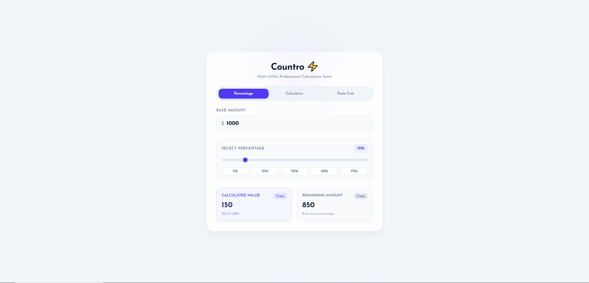
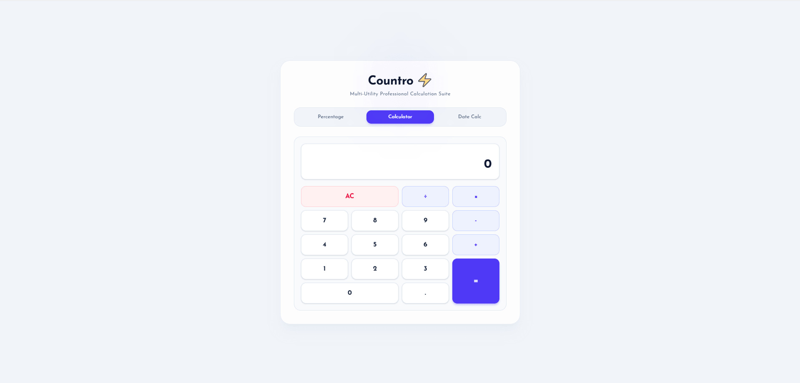
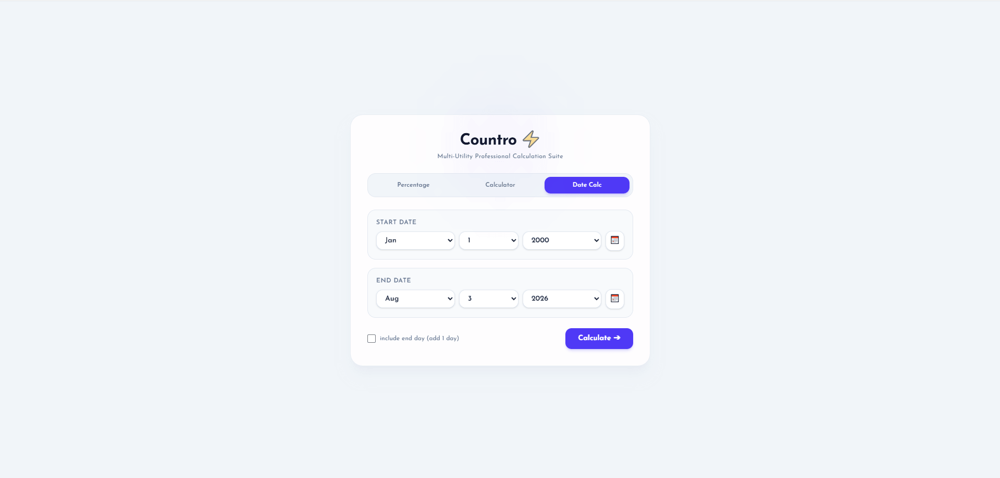

# ⚡ Countro — Multi-Utility Calculation Suite

**Countro** is a fast, precise, and modern web application built to streamline everyday multi-utility calculations. Designed with a clean UI, seamless micro-interactions, and offline capabilities, Countro provides an all-in-one suite for percentage calculations, standard arithmetic, and date duration estimations.

---

## 📸 Screenshots

<p align="center">
  
</p>

<p align="center">
  
  
</p>

---

## ✨ Key Features

* **🧮 Percentage Calculator Suite:**
  * Quick percentage finder (X% of Y)
  * Percentage change & growth estimation
  * Discount & markup calculator

* **🔢 Standard Calculator:**
  * Clean, interactive, and fast arithmetic operations
  * Real-time calculation feedback

* **📅 Date & Duration Calculator:**
  * Difference between two dates (Years, Months, Days)
  * Date addition and subtraction for project deadlines

* **📱 Progressive Web App (PWA):**
  * Installable as a native app on Desktop & Mobile
  * Full offline support via Custom Service Worker caching

* **🎨 Modern & Responsive Design:**
  * Sleek glassmorphism visual layout
  * Fully responsive across all device screen sizes

---

## 🛠️ Tech Stack

* **Framework:** [Next.js](https://nextjs.org/) (App Router)
* **Library:** [React.js](https://react.dev/)
* **Styling & UI:** [Tailwind CSS](https://tailwindcss.com/)
* **Offline & PWA:** Native Service Worker & Web App Manifest
* **Deployment:** [Vercel](https://vercel.com/)

---

## 👤 Author

Developed with ❤️ by **Salman Sahed**

* **Facebook:** [Salman Sahed](https://facebook.com/salmansahedbd)
* **LinkedIn:** [Salman Sahed](https://www.linkedin.com/in/salman-sahed)
* **GitHub:** [@salmansahed](https://github.com/salmansahed)
* **Portfolio:** [Salman Sahed](https://salman-sahed.vercel.app)

---

## 🚀 Getting Started (Installation & Setup)

Follow these steps to run the project locally on your machine:

### 1. Clone the repository
```bash
git clone https://github.com/salmansahed/countro.git
cd countro
npm install
npm run dev